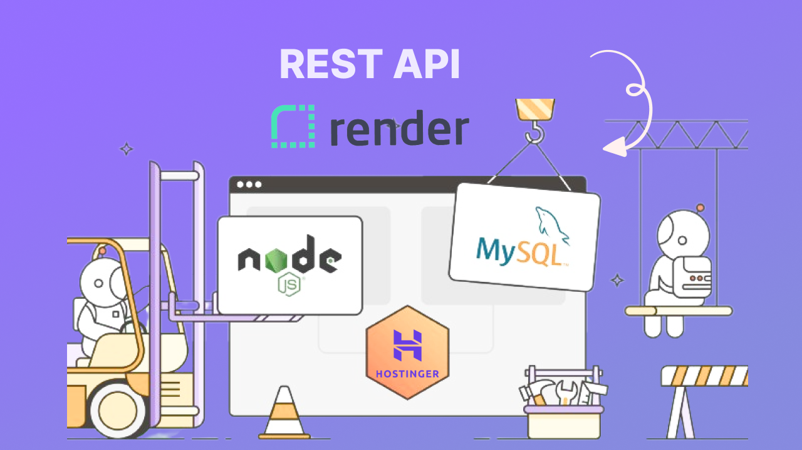

# Building a REST API with Node.js, MySQL, and Hosting on Render | Part 1 🔥

Welcome to Part 1 of our exciting series on building a powerful REST API using Node.js, connecting to a remote MySQL server, and hosting it on Render. If you've watched the video, you're in the right place to access the accompanying code and resources.

## Features

- Learn how to create a robust REST API.
- Connect seamlessly to a remote MySQL server.
- Host your API on Render for a scalable deployment.
- Step-by-step guidance to understand the fundamentals.
- Detailed instructions on setting up your development environment.
- Explore the intricacies of connecting Node.js to MySQL.

## Getting Started

To get started, simply follow the instructions provided in the accompanying video. You'll find all the code and resources you need in this repository.

## Join the Community

Join our Facebook Group: [codsfli](https://web.facebook.com/groups/codsfli/)

## Support

If you found the video and code helpful, please don't forget to like, share, and subscribe to our channel. Click the bell icon to receive notifications of new videos.
